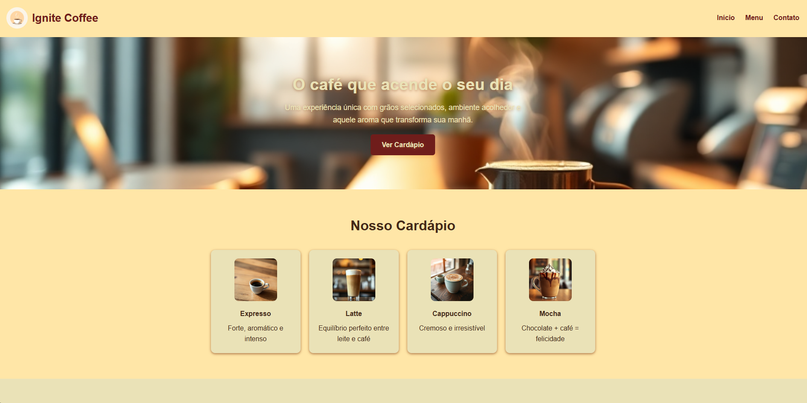

# ☕ [Ignite Coffee - Landing Page](https://ignite-coffee-landing-page.vercel.app/)

Uma landing page moderna e minimalista criada para uma cafeteria fictícia chamada **Ignite Coffee**.
O projeto demonstra domínio de **HTML5 + CSS3 puro**, com foco em boa estrutura semântica, organização visual e componentes simples.

---

## 🚀 Objetivo do Projeto

Criar uma interface visualmente agradável e funcional utilizando apenas tecnologias básicas do front-end, reforçando fundamentos importantes para qualquer desenvolvedor iniciante.

---

## ✨ Destaques

- Layout clean e responsivo
- HTML semântico
- CSS organizado e fácil de manter
- Hero com imagem de destaque
- Cardápio com ícones ilustrativos
- Experiência fluida e simples

---

## 🛠 Tecnologias Utilizadas

- **HTML5**
- **CSS3**
- **Semântica**
- **Grid Layout**

---

## 📸 Preview

---

## 📌 Status do Projeto 

✅ Concluído
Pode ser expandido futuramente com:
- Animações
- Menu interativo
- Versão mobile aprimorada

---

## 👤 Autor

Projeto desenvolvido por **Uelinton Janke**.
Sinta-se à vontade para abrir issues, sugestões ou melhorias!
