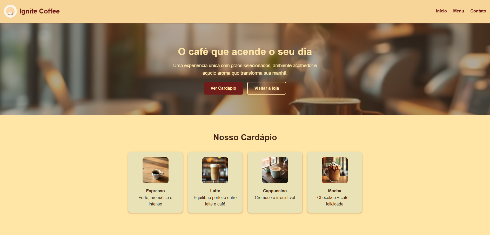

# ☕ [Ignite Coffee — Landing Page](https://ignite-coffee-landing-page.vercel.app/)

Ignite Coffee é uma landing page para uma cafeteria fictícia, criada inicialmente como umm projeto de prática em **HTML e CSS**, e posteriormente **refatorada de forma incremental** para refletir boas práticas modernas de front-end, UX e organização de código.

Este projeto não foi reescrito do zero. Ele foi **evoluído**.

---

## 📘 Micro-história do projeto

### Situação

O Ignite Coffee nasceu como uma landing page estática para praticar HTML semântico, CSS puro e layout responsivo, com foco em um visual moderno e agradável.

### Incômodo

Apesar de funcional e visualmente consistente, o projeto apresentava limitações comuns em projetos iniciais:
* Estrutura de código rígida
* Estilos pouco reutilizáveis
* Lógica de interação simples demais para evoluir com segurança
* Pouca separação de responsabilidades entre layout, componentes e comportamento

### Ação

Refatorei o projeto de forma **incremental**, mantendo o visual e o propósito original, mas melhorando:
* A **semântica e hierarquia do HTML**
* A **organização e previsibilidade do CSS**, com variáveis e componentes claros
* A **experiência do menu mobile**, com controle explícito de estado, fechamento automático e feedback de acessibilidade
* Pequenos detalhes de **UX**, como micro-interações, header fixo e CTA secundário

### Aprendizado

Aprendi que refatorar não é "jogar tudo fora", mas tornar o código **mais legível, previsível e amigável para o futuro**. <br/>
Pensar como dono do produto muda a forma como escrevo código: cada decisão facilita (ou dificulta) a evolução do projeto amanhã.

---

## 🚀 O que foi melhorado na prática

### 🧱 HTML — Semântica e responsabilidades
* Uso claro de ```<header>```, ```<main>```, ```<section>``` e ```<footer>```
* Separação entre identidade visual, navegação e controle do menu mobile
* Cardápio estruturado como lista semântica (```ul > li ```)
* Melhor leitura por outros desenvolvedores e leitores de tela

### 🎨 CSS — Organização e previsibilidade
* Uso de **CSS Variables** para cores, sombras e temas
* Componentes nomeados de forma clara (```.menu-card```, ```.button-primary```, ```.button-secondary```)
* Estilos mais reutilizáveis e fáceis de ajustar
* Base sólida para evoluir para algo próximo de um design system

### ⚙️ JavaScript — Clareza e UX
* Controle explícito do estado do menu mobile
* Atualização correta de ```aria-expanded```
* Fechamento automático do menu ao clicar em links
* Código simples, previsível e fácil de manter

### ✨ UX — Pequenos detalhes que fazem diferença
* CTA secundário no hero
* Header sticky para facilitar navegação
* Hover sutil nos cards do cardápio
* Feedback visual em links de navegação

---

## 🛠 Tecnologias utilizadas

* HTML5 (semântica e acessibilidade) 
* CSS3 (Grid, variáveis, responsividade)
* JavaScript (interações e controle de estado)
* Git & GitHub
* Vercel (deploy)

---

## 📸 Preview



---

## 📦 Como executar o projeto

```
git clone https://github.com/UelintonHJ/ignite-coffee.git
cd ignite-coffee
```
Abra o arquivo index.html no navegador
Ou acesse a versão online:
[https://ignite-coffee-landing-page.vercel.app/](https://ignite-coffee-landing-page.vercel.app/)

---

## 👤 Autor

**Uelinton Janke** <br/>
Desenvolvedor Front-End com foco em evolução contínua, clareza de código e mentalidade de produto. <br/>

LinkedIn: [https://www.linkedin.com/in/uelinton-janke/](https://www.linkedin.com/in/uelinton-janke/)
